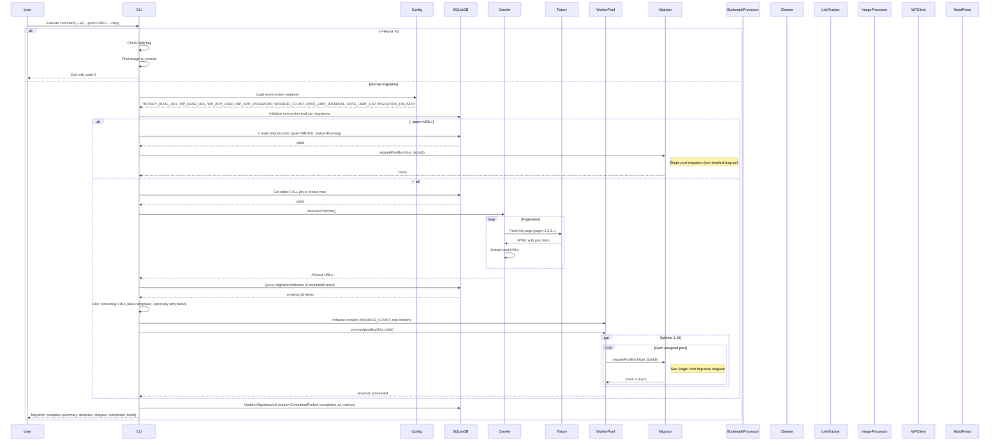
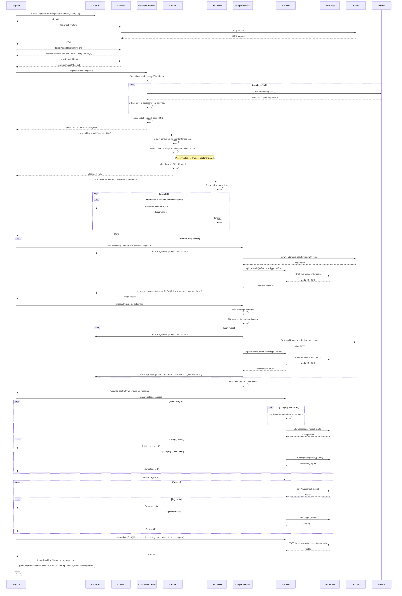
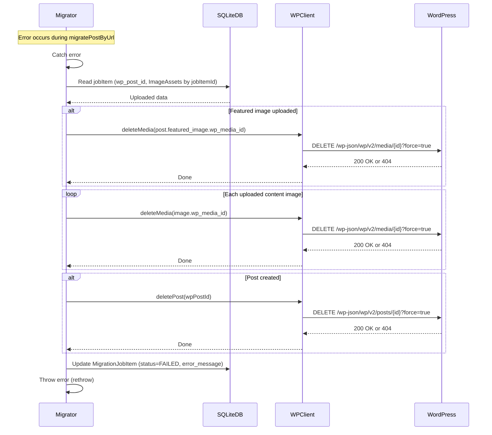
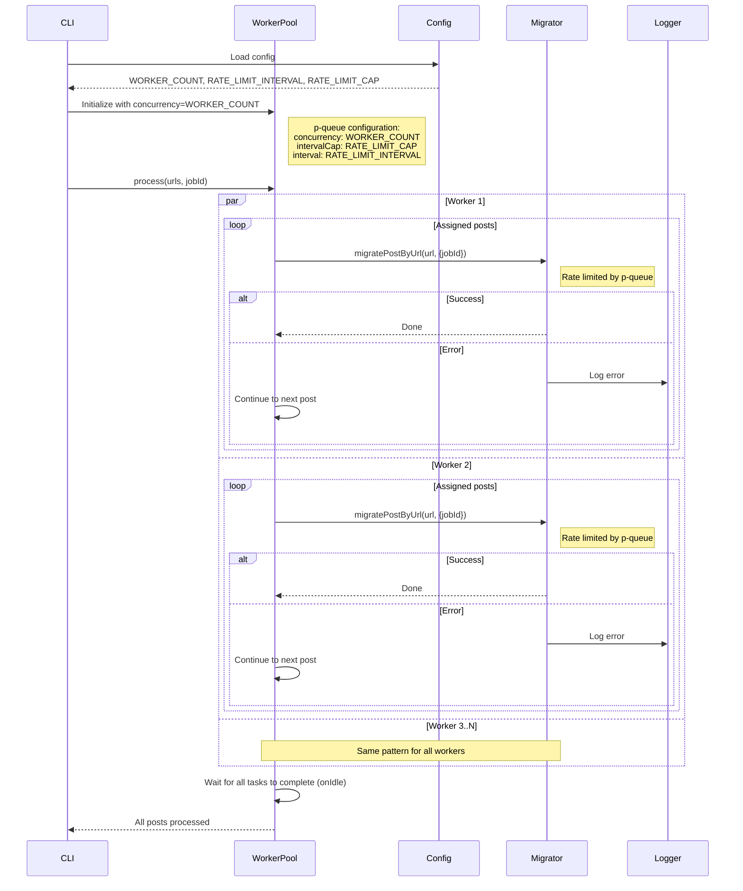
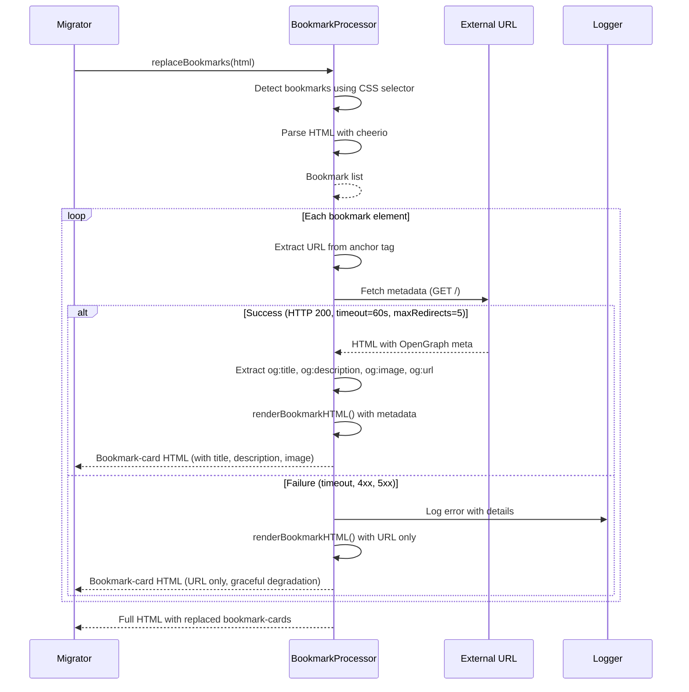
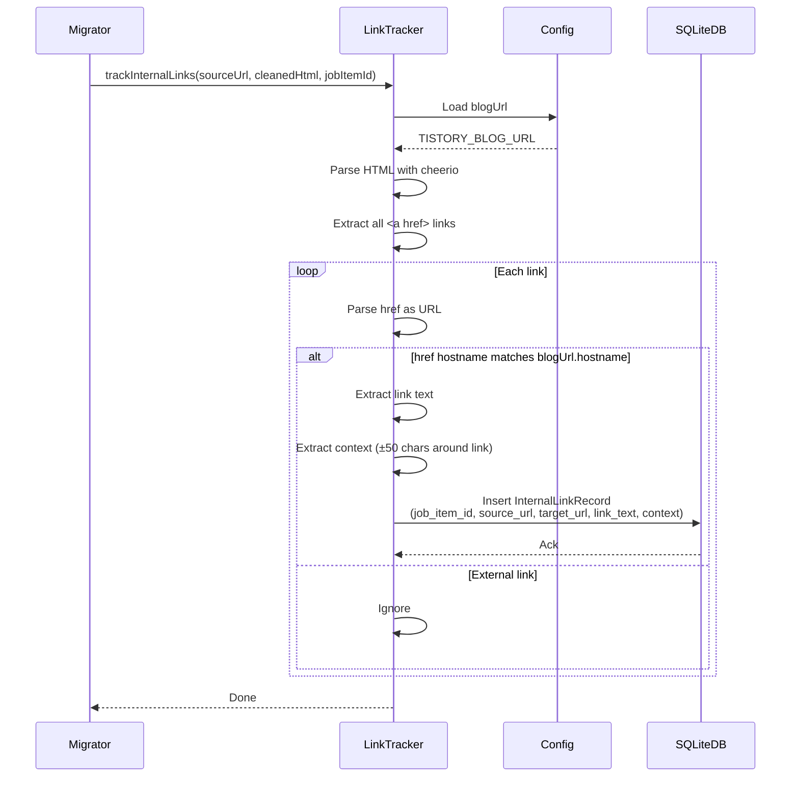
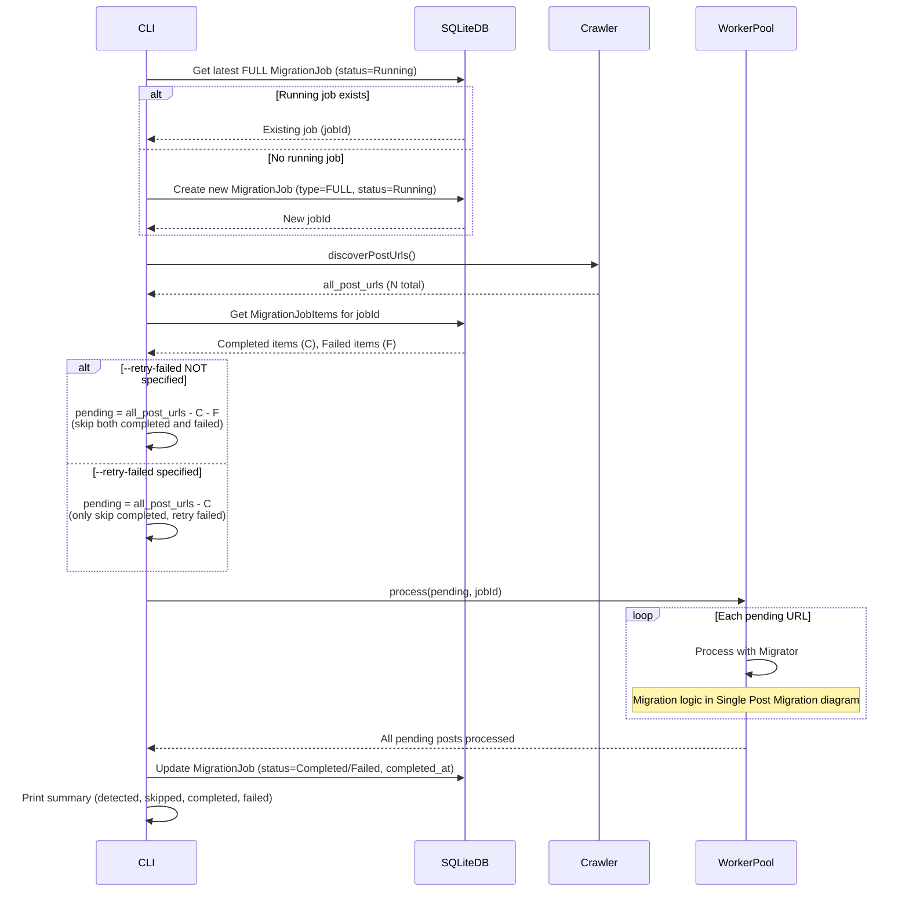

# Sequence Diagram: Tistory2Wordpress Migration

**Date**: 2026-01-07 | **Spec**: [spec.md](./spec.md)
**Purpose**: Visual representation of migration pipeline, worker pool processing, SQLite state, rollback, and WordPress REST interactions

## Sequence Diagrams

### Complete Migration Flow (Overview)

---

### Single Post Migration

---

### Error Handling & Rollback

**Key Points**:

- Rollback is best-effort: failures are logged but don't stop the rollback process
- Delete order: featured image → content images → post (reverse of creation order)
- WordPress REST API uses `?force=true` to bypass trash
- MigrationJobItem status remains FAILED even if rollback succeeds

---

### WorkerPool Parallel Processing

**Rate Limiting**:

사용자 관점:

- `RATE_LIMIT_INTERVAL` 동안 `RATE_LIMIT_CAP`번까지만 요청하도록 제한합니다.
- `WORKER_COUNT`는 동시 처리(병렬 처리) 작업 수입니다.
- `WORKER_COUNT`를 늘리면 병렬 처리가 가능하지만, 그럼에도 전체 요청 속도는 `RATE_LIMIT_CAP`에 의해 제한됩니다.

구현 관점:

- p-queue 설정: `concurrency=WORKER_COUNT`, `interval=RATE_LIMIT_INTERVAL`, `intervalCap=RATE_LIMIT_CAP`

예시:

- `WORKER_COUNT=1`, `RATE_LIMIT_INTERVAL=60000ms`, `RATE_LIMIT_CAP=1` → 분당 최대 1회 요청, 단일 작업자
- `WORKER_COUNT=4`, `RATE_LIMIT_INTERVAL=60000ms`, `RATE_LIMIT_CAP=1` → 분당 최대 1회 요청, 4개의 작업자가 병렬 처리

---

### Bookmark Processing

**Key Points**:

- Metadata fetch happens BEFORE HTML cleaning
- No caching: duplicate URLs are fetched multiple times
- Graceful degradation: failed fetches fall back to URL-only rendering
- Retry mechanism: exponential backoff for HTTP failures
- Security: all user input is HTML-escaped

---

### Link Tracking

**Internal Link Record**:

- `job_item_id`: Migration job item ID
- `source_url`: Source post URL
- `target_url`: Target post URL (internal)
- `link_text`: Anchor text
- `context`: Surrounding text for context

---

### Resume Migration (--all with --retry-failed)

**Resume Logic**:

- Existing `status=Running` job is reused
- Completed items are always skipped
- Failed items are skipped unless `--retry-failed` is specified
- Database tracks progress at individual post level
- Can safely restart after interruption

---

## Component Definitions

### CLI (cli.ts)

- **Responsibility**: Entry point, command parsing, orchestration
- **Key Operations**: Check flags, load config, initialize DB, invoke crawler/migrator, print summary

### Config (utils/config.ts)

- **Responsibility**: Load and validate environment variables
- **Key Configuration**: Blog URL, WordPress credentials, worker count, rate limit, selectors

### DB (db/index.ts)

- **Responsibility**: SQLite database for state tracking
- **Key Operations**: Initialize schema, create/update MigrationJob, MigrationJobItem, ImageAsset, PostMap, InternalLink

### Crawler (services/crawler.ts)

- **Responsibility**: Discover and fetch Tistory blog content
- **Key Operations**: discoverPostUrls() with pagination, fetchPostHtml(), parsePostMetadata(), extractFImgUrl()

### WorkerPool (workers/postProcessor.ts)

- **Responsibility**: Manage concurrent post processing with rate limiting
- **Key Operations**: Initialize p-queue, distribute work, enforce rate limits per worker

### Migrator (services/migrator.ts)

- **Responsibility**: Orchestrate single post migration workflow
- **Key Operations**: Coordinate crawler, bookmark processor, cleaner, link tracker, image processor, WP client; handle rollback

### BookmarkProcessor (services/bookmarkProcessor.ts)

- **Responsibility**: Detect and transform Tistory bookmarks
- **Key Operations**: detectBookmarks(), fetchMetadata() (with retry), replaceBookmarks()

### Cleaner (services/cleaner.ts)

- **Responsibility**: Clean HTML via Markdown roundtrip
- **Key Operations**: Extract content, HTML→Markdown→HTML conversion, preserve tables/iframes/bookmark-cards

### LinkTracker (services/linkTracker.ts)

- **Responsibility**: Track internal links between posts
- **Key Operations**: Extract links, identify internal links, insert to DB

### ImageProcessor (services/imageProcessor.ts)

- **Responsibility**: Download and upload images to WordPress
- **Key Operations**: Download with retry, upload to WordPress media library, skip bookmark-card images, rewrite URLs

### WPClient (services/wpClient.ts)

- **Responsibility**: WordPress REST API communication
- **Key Operations**: ensureCategory(), ensureTag(), createDraftPost(), uploadMedia(), deletePost(), deleteMedia()

---

## Cross-Feature Interactions

**CLI → Crawler → WorkerPool → Migrator Pipeline**:

- CLI discovers all URLs via Crawler
- WorkerPool distributes URLs to workers
- Each worker invokes Migrator for each post

**Migrator Coordination**:

- Sequential execution: fetch → parse → bookmarks → clean → links → images → WordPress API
- All operations within a single post are sequential (no parallelism within post)
- Parallelism happens at post level via WorkerPool

**BookmarkProcessor ↔ Cleaner**:

- BookmarkProcessor generates `<figure class="bookmark-card">` HTML
- Cleaner preserves this structure through Turndown roundtrip
- Order: BookmarkProcessor BEFORE Cleaner

**ImageProcessor ↔ BookmarkProcessor**:

- ImageProcessor skips images inside `figure.bookmark-card`
- Prevents duplicate upload of bookmark featured images

**LinkTracker ↔ ImageProcessor**:

- Both operate on cleaned HTML
- LinkTracker tracks before image URL rewriting
- Internal links contain original Tistory URLs

**Rollback ↔ All Services**:

- Rollback happens on any error in Migrator
- Only resources created during migration are rolled back
- WordPress API calls are idempotent (DELETE with force=true)

---

## Notes

**Error Handling Strategy**:

- Per-post error handling: individual failures don't stop entire migration
- Retry mechanism: exponential backoff for network operations
- Rollback: best-effort cleanup on failure
- Logging: all errors logged with context

**Rate Limiting**:

- Applied at WorkerPool level (p-queue)
- 제한 모델: `RATE_LIMIT_INTERVAL` 동안 `RATE_LIMIT_CAP`번 요청 허용
- Ensures we don't overwhelm Tistory or WordPress

**State Persistence**:

- SQLite database tracks all migration state
- Can resume from any point of interruption
- Completed posts are never reprocessed

**Security**:

- WordPress authentication via Application Password (Basic Auth)
- All user input HTML-escaped in bookmark templates
- External links use `target="_blank" rel="noopener noreferrer"`

**Performance Considerations**:

- Worker pool enables parallel post processing
- Rate limiting prevents server overload
- No caching for bookmark metadata (by design)
- Image download/upload is the slowest part of migration

**Database Schema Summary**:

- `migration_jobs`: Track migration jobs (SINGLE/FULL)
- `migration_job_items`: Track individual post migration status
- `image_assets`: Track image upload status
- `post_maps`: Map Tistory URLs to WordPress post IDs
- `internal_links`: Track internal links for later URL updates
