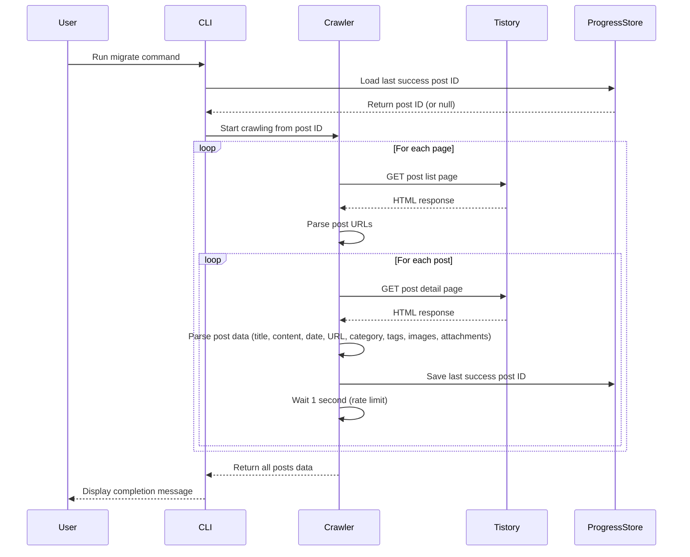
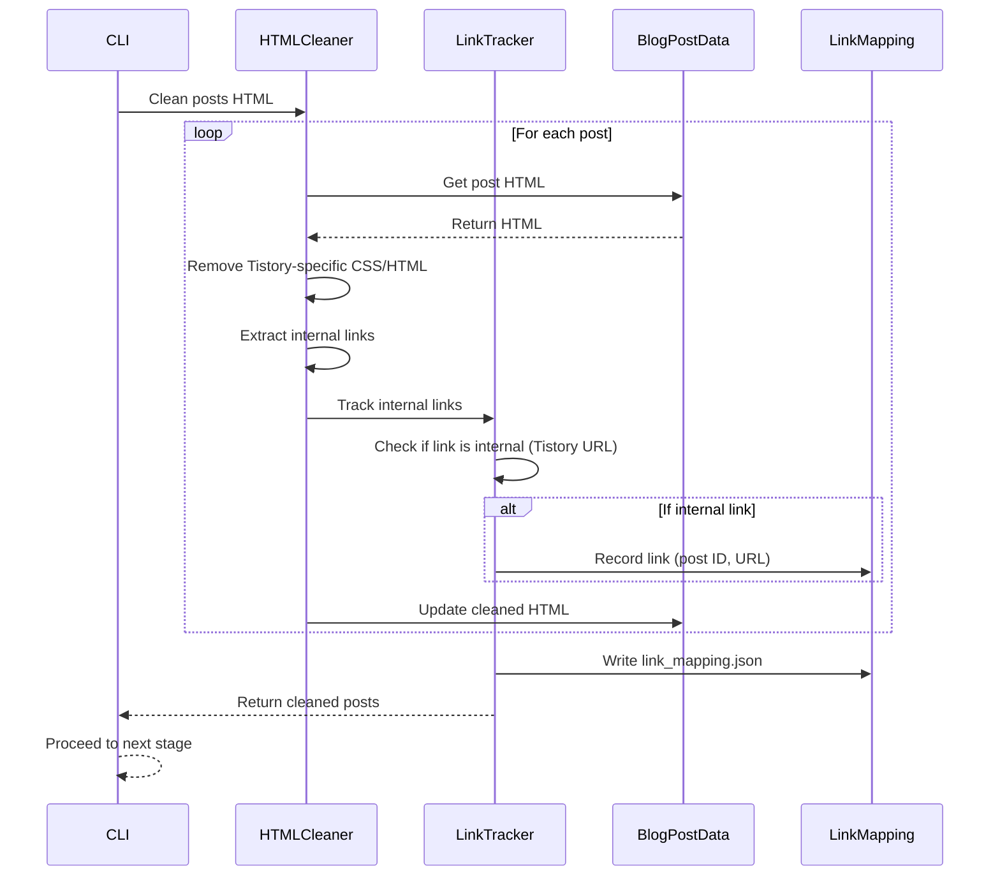
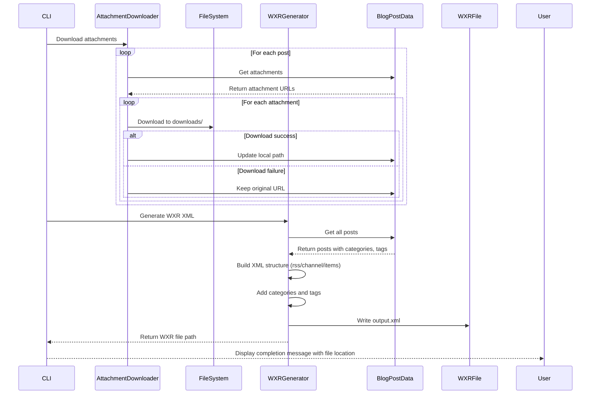

# Sequence Diagram: Tistory to WordPress Migration

**Branch**: `001-name-tistory-wordpress` | **Date**: 2025-12-25 | **Spec**: [spec.md](spec.md)
**Purpose**: Visual representation of user journeys, API calls, and system interactions

## Sequence Diagrams

### User Story 1 - Tistory 게시글 데이터 수집 (Priority: P1)

**Key Interactions**:
- 크롤러는 마지막 성공한 게시글 ID에서부터 재개 가능
- 각 요청마다 1초 딜레이로 Tistory 서버에 부하 최소화
- 에러 발생 시 로그 기록 후 마지막 성공한 지점에서 재개

---

### User Story 2 - 데이터 정제 및 내부 링크 추적 (Priority: P2)

**Key Interactions**:
- Tistory 전용 CSS/HTML 요소 제거로 WordPress 호환성 보장
- 내부 링크 식별 및 link_mapping.json에 기록
- 내부 링크는 Tistory 블로그 URL 패턴 매칭으로 식별

---

### User Story 3 - WXR 파일 생성 (Priority: P3)

**Key Interactions**:
- 첨부파일 다운로드는 `downloads/` 디렉토리에 저장
- 다운로드 실패 시 원래 URL 유지
- WXR 파일에 게시글, 카테고리, 태그 포함
- WordPress Importer 0.9.5 호환 포맷 사용

---

## Component Definitions

### CLI
- **Responsibility**: 명령줄 인터페이스, 환경변수 로드, 전체 워크플로우 조율
- **Key Operations**: parse arguments, load config, orchestrate pipeline

### Crawler
- **Responsibility**: Tistory 블로그 크롤링, 페이지네이션 처리, 게시글 파싱
- **Key Operations**: crawl_posts, parse_post_list, parse_post_detail, save_progress

### HTMLCleaner
- **Responsibility**: HTML 정제, Tistory 전용 요소 제거
- **Key Operations**: clean_html, remove_tistory_styles, extract_internal_links

### LinkTracker
- **Responsibility**: 내부 링크 식별, 링크 매핑 파일 생성
- **Key Operations**: track_links, is_internal_link, write_mapping_file

### AttachmentDownloader
- **Responsibility**: 첨부파일 다운로드, 로컬 경로 업데이트
- **Key Operations**: download_attachments, save_to_disk, handle_failure

### WXRGenerator
- **Responsibility**: WXR XML 파일 생성, WordPress Importer 호환 포맷
- **Key Operations**: generate_wxr, build_rss, add_posts, add_categories, add_tags

### ProgressStore
- **Responsibility**: 크롤링 진행 상태 저장 및 로드
- **Key Operations**: save_progress, load_progress, get_last_post_id

## Cross-Feature Interactions

- **Crawler → ProgressStore**: 마지막 성공한 게시글 ID 저장으로 재개 가능성 보장
- **HTMLCleaner → LinkTracker**: 내부 링크 추적으로 마이그레이션 후 링크 유지
- **AttachmentDownloader → WXRGenerator**: 다운로드된 첨부파일 경로 정보 공유

---

## Notes

- 모든 HTTP 요청은 rate-limiting (기본 1초 딜레이)으로 Tistory 서버 보호
- 에러 발생 시 로그 기록 및 재개 가능성 보장
- 첨부파일 다운로드 실패는 WXR 파일 생성에 영향 없음
- 내부 링크는 수정하지 않고 link_mapping.json에만 기록
