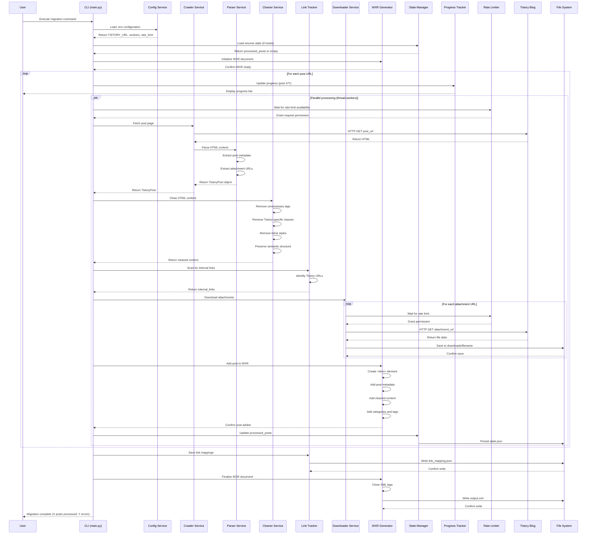
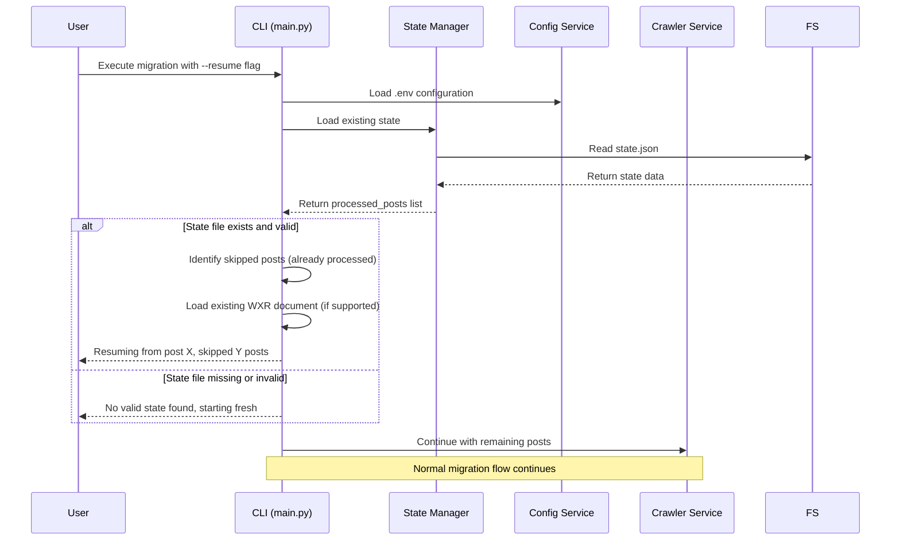
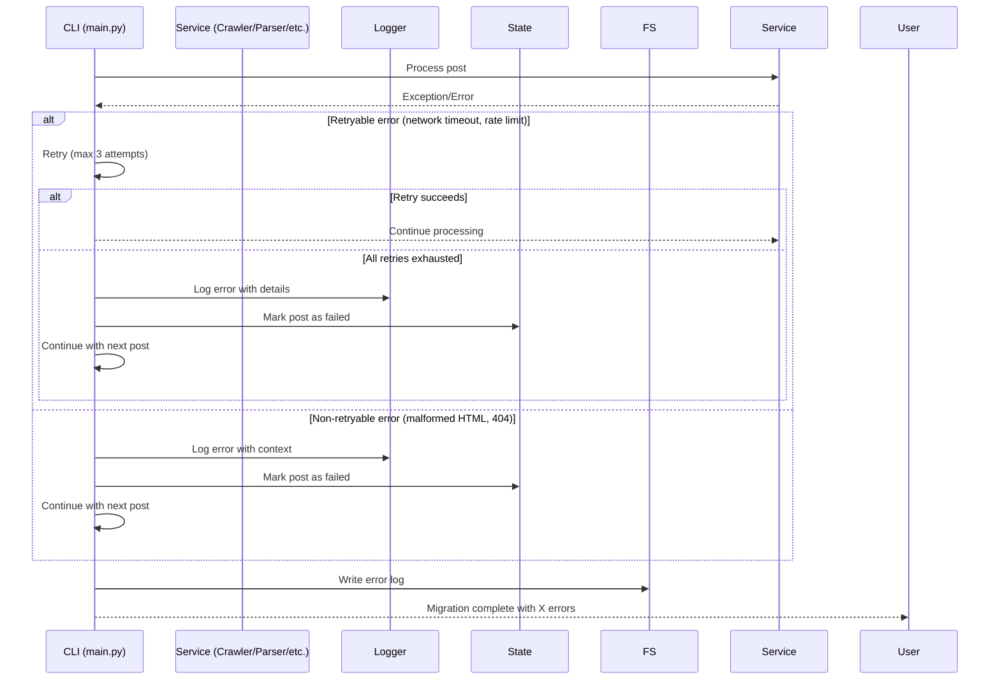
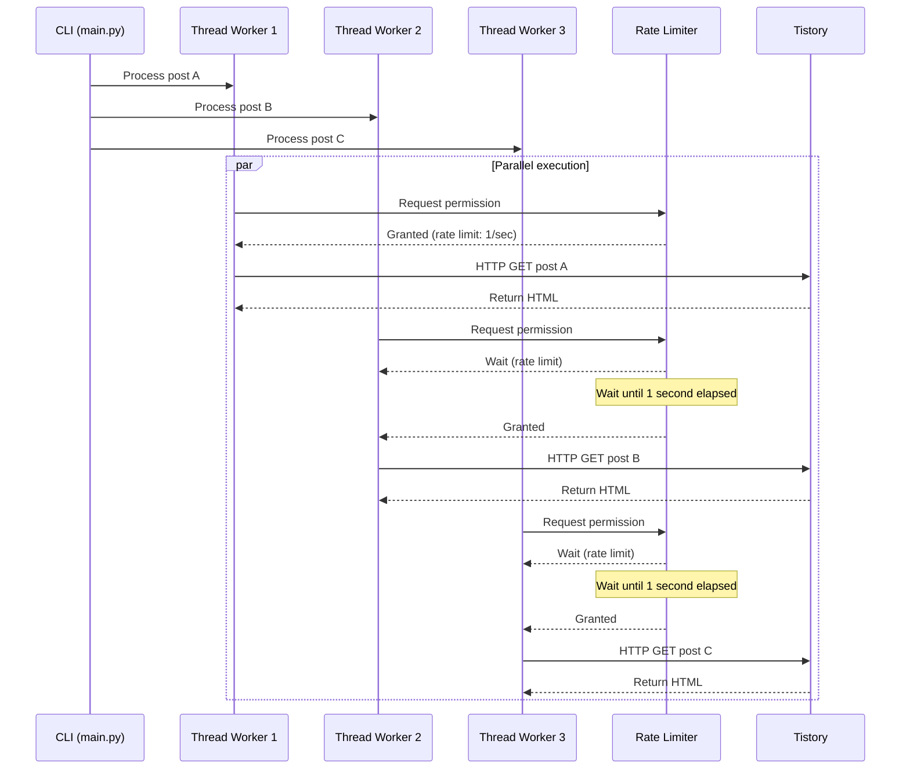

# Sequence Diagram: Tistory to WordPress Migration

**Branch**: `002-tistory-wordpress-migration` | **Date**: 2025-12-28 | **Spec**: [spec.md](./spec.md)
**Purpose**: Visual representation of user journeys, API calls, and system interactions

## Sequence Diagrams

### Feature 1 - Full Migration Flow (Priority: P1)

**Key Interactions**:
- CLI orchestrates entire migration flow with parallel threading
- Rate limiter controls request pacing per worker
- State tracking enables resume capability
- Progress tracker provides real-time feedback to user
- WXR generator immediately adds each processed post to in-memory document
- Downloader only processes attachments (not images)

---

### Feature 2 - Resume from Interruption (Priority: P2)

**Key Interactions**:
- State manager reads existing state to identify already processed posts
- Resume skips previously processed posts based on URL matching
- Allows continuation from interruption point

---

### Feature 3 - Error Handling and Logging (Priority: P2)

**Key Interactions**:
- Retry logic for transient errors (network issues)
- Immediate logging for permanent errors (malformed content)
- State tracking records failed posts for reference
- Migration continues despite individual post failures

---

### Feature 4 - Rate Limiting with Parallel Workers (Priority: P3)

**Key Interactions**:
- Thread-safe rate limiter coordinates across all workers
- Each worker independently requests permission
- Rate limiter enforces global rate limit (1 req/sec default)
- Workers continue processing independently after permission granted

---

## Component Definitions

### CLI (main.py)
- **Responsibility**: User interface and orchestration of all services
- **Key Operations**:
  - Parse command-line arguments
  - Initialize all services
  - Coordinate parallel processing
  - Display progress to user
  - Handle errors and exit gracefully

### Config Service (config.py)
- **Responsibility**: Load and validate configuration from environment variables
- **Key Operations**:
  - Load .env file
  - Validate TISTORY_URL
  - Get worker count (default 5)
  - Get rate limit (default 1 req/sec)
  - Get output file path

### State Manager (state.py)
- **Responsibility**: Track migration state for resume capability
- **Key Operations**:
  - Load existing state from state.json
  - Track processed post URLs
  - Track failed post URLs with error details
  - Persist state to state.json
  - Validate state integrity

### Progress Tracker (progress.py)
- **Responsibility**: Display migration progress to user
- **Key Operations**:
  - Calculate completion percentage
  - Update progress bar
  - Display processing speed
  - Show error count

### Crawler Service (crawler.py)
- **Responsibility**: Fetch HTML content from Tistory blog
- **Key Operations**:
  - Discover post URLs from blog index
  - Follow pagination to all pages
  - Fetch individual post pages
  - Handle HTTP errors and retries

### Parser Service (parser.py)
- **Responsibility**: Extract structured data from Tistory HTML
- **Key Operations**:
  - Parse post metadata (title, dates, URL)
  - Extract post content HTML
  - Extract categories
  - Extract tags
  - Extract image URLs with alt text
  - Extract attachment URLs with filenames

### Cleaner Service (cleaner.py)
- **Responsibility**: Remove Tistory-specific HTML/CSS, preserve semantic content
- **Key Operations**:
  - Remove Tistory-specific CSS classes
  - Remove inline styles
  - Preserve semantic HTML structure
  - Preserve image elements with URLs
  - Preserve internal links for tracking

### Link Tracker (tracker.py)
- **Responsibility**: Identify and record internal Tistory links
- **Key Operations**:
  - Scan content for internal Tistory URLs
  - Identify source and target post URLs
  - Accumulate link mappings
  - Write link_mapping.json

### Downloader Service (downloader.py)
- **Responsibility**: Download attachment files to local storage
- **Key Operations**:
  - Fetch attachment from URL
  - Extract filename from URL
  - Save to downloads/ directory
  - Handle download errors
  - Note: Images are NOT downloaded (URLs preserved in WXR)

### WXR Generator (wxr_generator.py)
- **Responsibility**: Generate WordPress Importer-compatible WXR XML
- **Key Operations**:
  - Initialize WXR document with WordPress namespaces
  - Add post <item> elements with metadata
  - Add post content with preserved image URLs
  - Add categories and tags
  - Finalize and write XML file

### Rate Limiter (rate_limiter.py)
- **Responsibility**: Enforce rate limiting across thread workers
- **Key Operations**:
  - Thread-safe permission granting
  - Enforce rate limit (default 1 req/sec)
  - Coordinate across all workers
  - Track request timestamps

## Cross-Feature Interactions

- **State Manager + All Services**: State manager tracks which posts have been processed, allowing all services to skip already-completed work during resume
- **Rate Limiter + Crawler + Downloader**: Rate limiter coordinates HTTP requests from both crawling and downloading to respect server load
- **Progress Tracker + All Services**: Progress tracker receives updates from all services to display comprehensive migration status
- **Link Tracker + Cleaner**: Cleaner preserves internal links for Link Tracker to identify and record
- **WXR Generator + All Services**: WXR Generator receives data from all services to build comprehensive WordPress import file

---

## Notes

- **Parallel Processing**: Threading (not multiprocessing) used due to Python GIL and I/O-bound nature of HTTP requests
- **Rate Limiting**: Global rate limit shared across all workers to respect server constraints
- **State Tracking**: Minimal state tracking (processed URLs) allows resume without storing full post data
- **Error Resilience**: Individual post failures do not stop migration; all errors logged for reference
- **Memory Efficiency**: WXR document kept in memory during processing; written once at completion
- **Image Handling**: Images NOT downloaded to keep process simple; URLs preserved in WXR for WordPress to handle
- **Attachment Handling**: Only non-image attachments downloaded to local downloads/ directory
