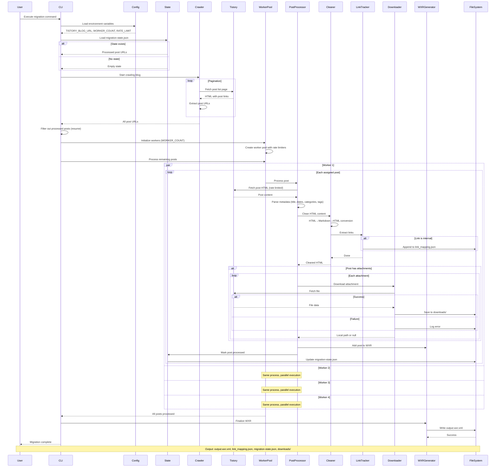
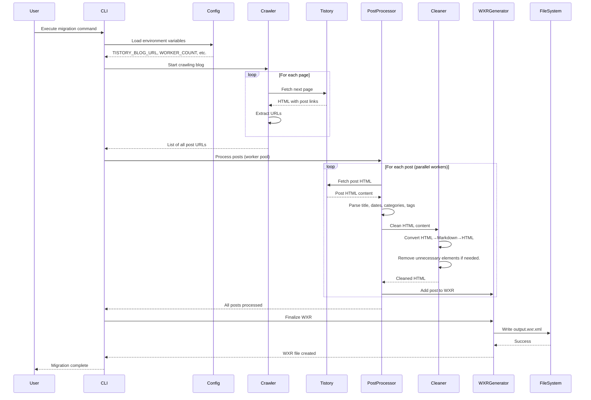
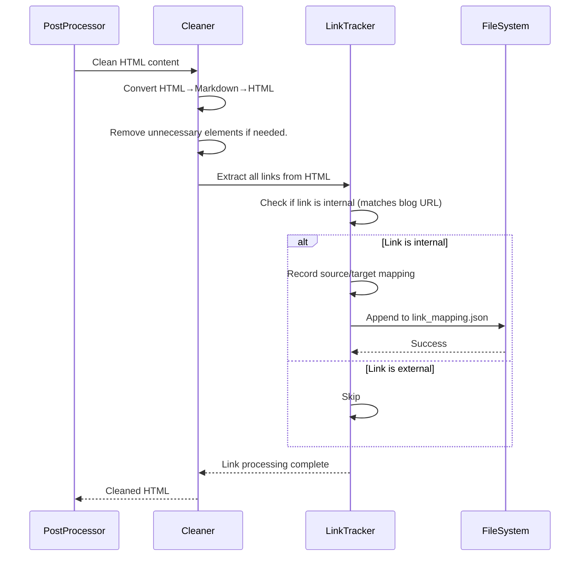
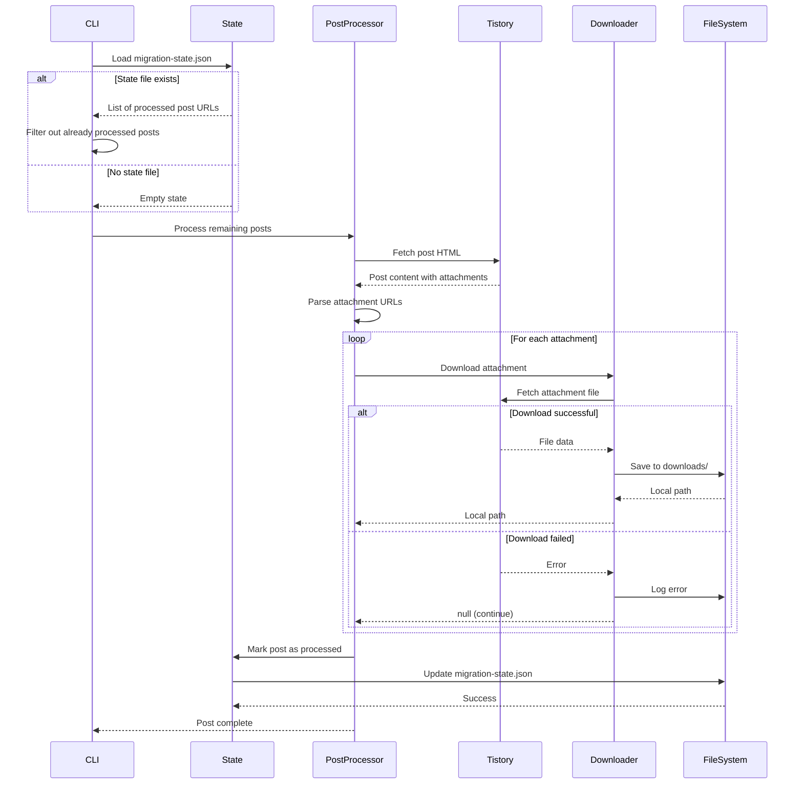
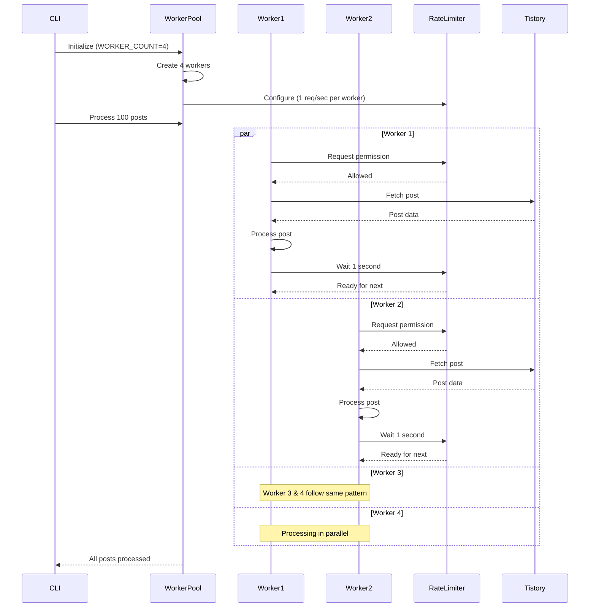

# Sequence Diagram: Tistory WXR Generator

**Branch**: `003-name-tistory-wxr-generator` | **Date**: 2025-12-29 | **Spec**: [spec.md](./spec.md)
**Purpose**: Visual representation of migration pipeline, worker pool processing, and system interactions

## Sequence Diagrams

### Complete Migration Flow (Overview)

**Complete Flow Summary**:
1. **Initialization**: Load config and check for existing state (resume capability)
2. **Discovery**: Crawl Tistory blog with pagination to get all post URLs
3. **Filtering**: Skip already processed posts (from state file)
4. **Parallel Processing**: Worker pool processes posts concurrently with rate limiting
5. **Per-Post Pipeline**: Fetch → Parse → Clean → Track Links → Download Attachments → Add to WXR → Update State
6. **Finalization**: Generate final WXR XML file
7. **Outputs**: WXR file, link mapping, state file, downloaded attachments

---

### Feature 1 - Basic Post Migration (Priority: P1)

**Key Interactions**:
- Crawler handles pagination automatically to collect all post URLs
- Worker pool processes multiple posts concurrently with rate limiting
- Each post goes through: fetch → parse → clean → add to WXR pipeline
- WXR is built incrementally as posts are processed

---

### Feature 2 - Internal Link Tracking (Priority: P2)

**Key Interactions**:
- Link tracking happens during HTML cleaning phase
- Internal links identified by comparing href to TISTORY_BLOG_URL
- link_mapping.json updated incrementally for each post
- External links ignored

---

### Feature 3 - Attachment Handling & Resume (Priority: P3)

**Key Interactions**:
- State file checked at startup to enable resume
- Already processed posts skipped
- Attachments downloaded with error handling (failures logged but don't stop migration)
- State updated after each post for granular resume capability
- Errors logged but don't halt entire migration

---

### Feature 4 - Parallel Processing with Rate Limiting (Priority: P4)

**Key Interactions**:
- Worker pool creates configurable number of workers (default: 4)
- Each worker has independent rate limiter (1 req/sec per worker)
- Workers process posts concurrently without interference
- Effective throughput: WORKER_COUNT * RATE_LIMIT requests/sec

---

## Component Definitions

### CLI
- **Responsibility**: Entry point, configuration loading, orchestration
- **Key Operations**: Initialize, load config, start crawler, manage worker pool, report completion

### Crawler
- **Responsibility**: Discover all post URLs from Tistory blog
- **Key Operations**: Fetch post list pages, handle pagination, extract post URLs

### PostProcessor
- **Responsibility**: Process individual posts through full pipeline
- **Key Operations**: Fetch post HTML, parse metadata, clean content, track links, download attachments, add to WXR

### Cleaner
- **Responsibility**: Remove Tistory-specific HTML/CSS via Markdown conversion
- **Key Operations**: Convert HTML→Markdown (turndown), Convert Markdown→HTML (marked)

### LinkTracker
- **Responsibility**: Identify and record internal links
- **Key Operations**: Extract links from HTML, check if internal, write to link_mapping.json

### Downloader
- **Responsibility**: Download attachments with error handling
- **Key Operations**: Fetch files, save to downloads/, handle errors gracefully

### WXRGenerator
- **Responsibility**: Build WordPress-compatible WXR XML
- **Key Operations**: Add posts/categories/tags, generate valid WXR structure, write XML file

### State
- **Responsibility**: Track migration progress for resume capability
- **Key Operations**: Load state, mark posts processed, save state incrementally

### WorkerPool
- **Responsibility**: Manage concurrent post processing with rate limiting
- **Key Operations**: Create workers, distribute work, enforce rate limits per worker

## Cross-Feature Interactions

- **Crawler → PostProcessor**: Crawler provides list of post URLs to worker pool for parallel processing
- **PostProcessor → Cleaner → LinkTracker**: Content cleaning automatically triggers link tracking
- **PostProcessor → State**: Every processed post updates state file for resume capability
- **WorkerPool → All Services**: Worker pool orchestrates all processing with concurrency and rate limiting
- **All Services → FileSystem**: Multiple outputs written (WXR, link_mapping.json, migration-state.json, downloads/)

---

## Notes

- All network requests to Tistory respect rate limiting (1 req/sec per worker)
- Error handling is non-blocking: failures logged but don't stop migration
- State tracking enables resume from any point of interruption
- WXR built incrementally to handle large blogs without memory issues
- Worker pool provides parallelism while respecting rate limits per worker
