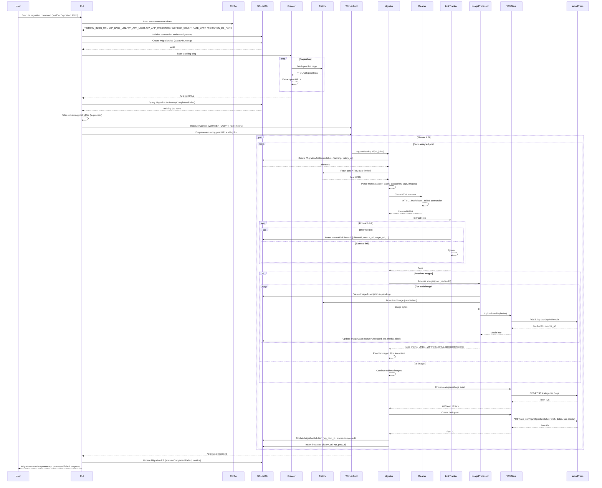
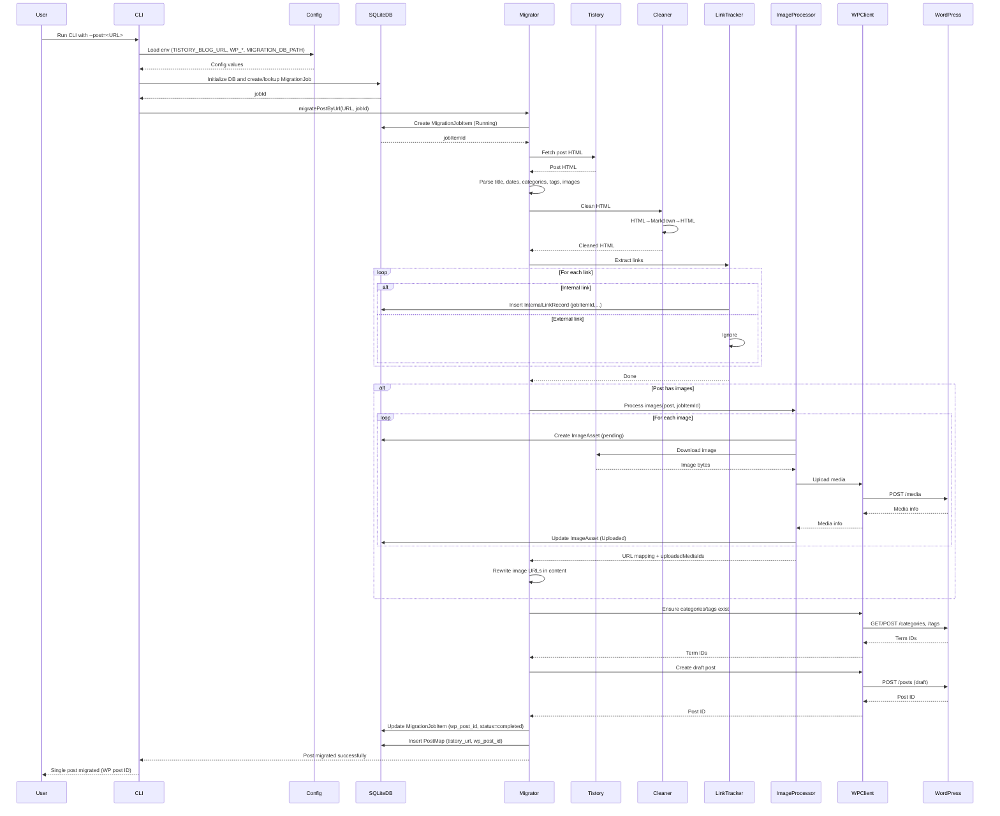
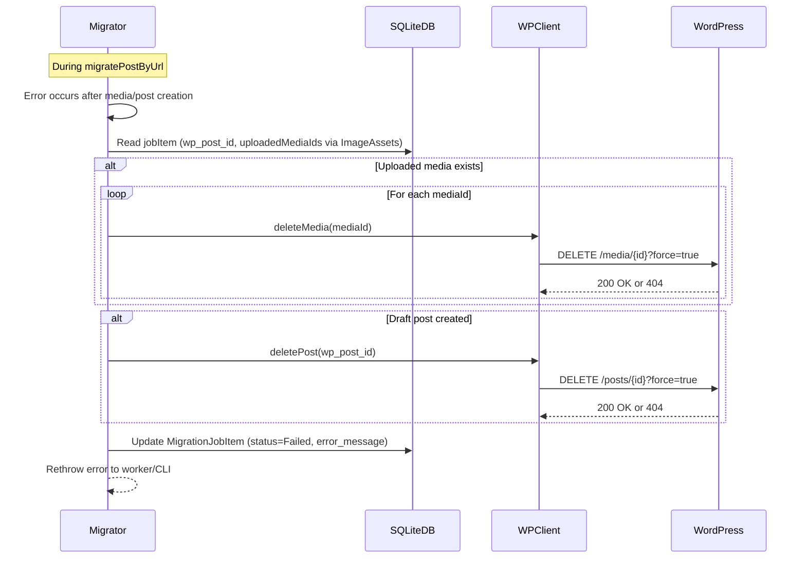
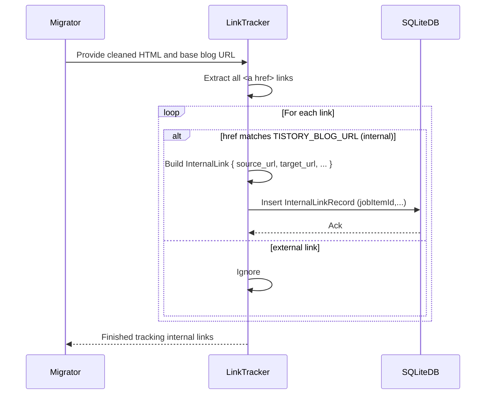
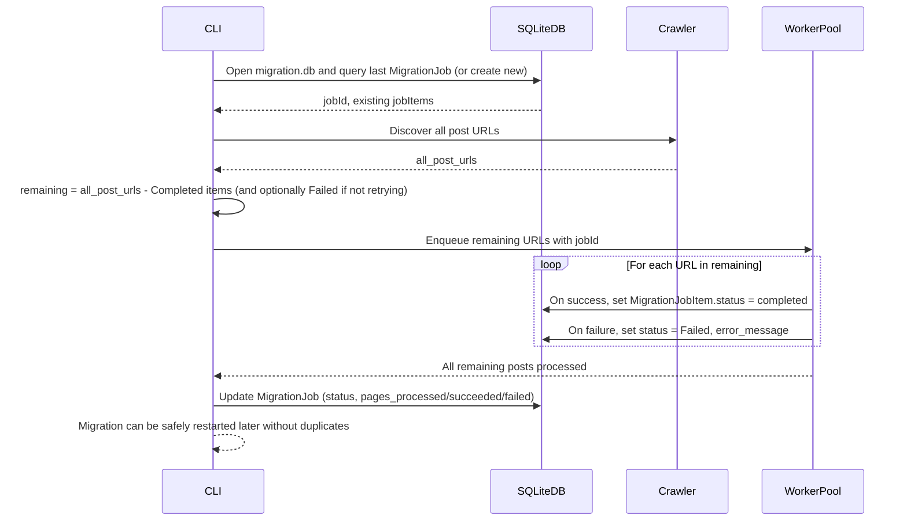

# Sequence Diagram: Tistory -> WordPress REST Migration

**Branch**: `005-tistory-wp-rest` | **Date**: 2026-01-01 | **Spec**: [spec.md](./spec.md)  
**Purpose**: Visual representation of migration pipeline, worker pool processing, SQLite state, rollback, and REST interactions

## Sequence Diagrams

### Complete Migration Flow (Overview)



---

### Single Post Migration with Rollback (P1 User Story)



#### Failure with Rollback



---

### Internal Link Tracking (P2 User Story)



---

### Resume with SQLite Migration State (NF requirement)



```

```
