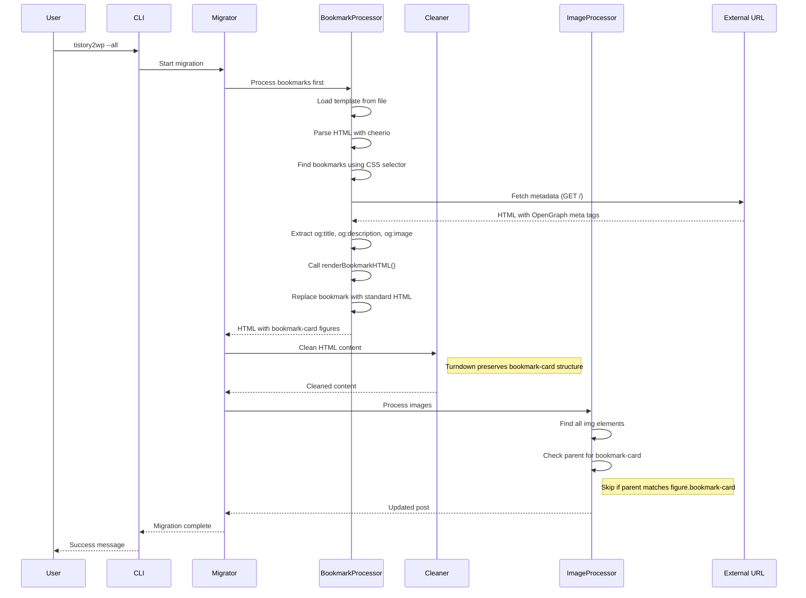

# Bookmark Processing Change Report

**Spec**: 007-cli-help-option | **Date**: 2026-01-07 | **Type**: Architecture Change

## Change Summary

북마크 처리 순서를 Cleaner 이전으로 이동하여, 표준화된 HTML 구조가 cleaning 단계에서 보존되도록 변경하고, 북마크 내부의 featured image를 이미지 다운로드/업로드에서 제외합니다.

## Current vs New Processing Flow

### Current Flow (Before)

```
Migrator
  └─> Cleaner (HTML cleaning + turndown roundtrip)
       └─> BookmarkProcessor (find bookmarks, fetch metadata, replace HTML)
            └─> ImageProcessor (find images, download & upload)
```

### New Flow (After)

```
Migrator
  └─> BookmarkProcessor (find bookmarks, fetch metadata, replace with standard HTML)
       └─> Cleaner (HTML cleaning + turndown roundtrip)
            └─> ImageProcessor (find images, skip bookmark featured images)
```

## Component Responsibilities

### 1. BookmarkProcessor (bookmarkProcessor.ts)

**Timing**: Cleaner 이전에 실행

**Operations**:

1. Load bookmark template from `@src/templates/bookmarkTemplate.ts`
2. Parse HTML with cheerio
3. Find Tistory bookmarks using CSS selector
4. For each bookmark:
   - Fetch metadata from external URL (GET /)
   - Extract og:title, og:description, og:image
   - Call `renderBookmarkHTML()` to generate standard HTML structure
   - Replace original bookmark with generated HTML
5. Return updated HTML to Migrator

**Error Handling**:

- If metadata fetch fails (timeout, 4xx, 5xx):
  - Log error
  - Render bookmark using URL only (graceful degradation)
  - Continue to next bookmark

### 2. Cleaner (cleaner.ts)

**Timing**: BookmarkProcessor 이후에 실행

**Operations**:

- Receive HTML that already contains `<figure class="bookmark-card">` elements
- Perform turndown roundtrip (HTML → Markdown → HTML)
- **Crucial**: Bookmark HTML structure must be preserved during this transformation

**Key Requirement**:

- Turndown configuration must NOT convert bookmark HTML to plain text
- Standard bookmark structure enables reliable preservation

### 3. ImageProcessor (imageProcessor.ts)

**Timing**: Cleaner 이후에 실행

**Operations**:

1. Find all `` elements in HTML
2. For each image, check parent element
3. **Skip images where**:
   - Parent is `<figure class="bookmark-card">`
   - Or ancestor contains `<figure class="bookmark-card">`
4. Download remaining images
5. Upload to WordPress

**Exclusion Logic**:

```typescript
// Skip if parent or ancestor is a bookmark card
if ($(img).closest('figure.bookmark-card').length > 0) {
  return; // Skip this image
}
```

## Standard Bookmark HTML Structure

Generated by `@src/templates/bookmarkTemplate.ts`:

```html
<figure class="bookmark-card" style="...">
  <a href="{url}" target="_blank" rel="noopener noreferrer" style="...">
    <div class="bookmark-featured-image" style="...">
      
    </div>
    <div class="bookmark-content" style="...">
      <h3 class="bookmark-title" style="...">{title}</h3>
      <p class="bookmark-description" style="...">{description}</p>
    </div>
  </a>
</figure>
```

**Key Identifiers**:

- `figure.bookmark-card` - Root container (used by ImageProcessor for exclusion)
- `img` inside `div.bookmark-featured-image` - Featured image to skip

## Sequence Diagram Updates

### Feature 2 - Tistory Bookmark Handling (Updated)



## Affected Components

| Component              | Change Type   | Description                                                   |
| ---------------------- | ------------- | ------------------------------------------------------------- |
| `migrator.ts`          | **Modified**  | Update orchestration to call BookmarkProcessor before Cleaner |
| `bookmarkProcessor.ts` | **Moved**     | Called earlier in pipeline, same logic                        |
| `cleaner.ts`           | **No change** | Receives pre-processed bookmark HTML                          |
| `imageProcessor.ts`    | **Modified**  | Add logic to skip images in bookmark-card figures             |
| `sequence-diagram.md`  | **Modified**  | Update to reflect new order                                   |

## Implementation Notes

### Migrator Changes

```typescript
// Before
const cleaned = await this.cleaner.clean(content);
const withBookmarks = await this.bookmarkProcessor.process(cleaned);
const withImages = await this.imageProcessor.process(withBookmarks);

// After
const withBookmarks = await this.bookmarkProcessor.process(content);
const cleaned = await this.cleaner.clean(withBookmarks);
const withImages = await this.imageProcessor.process(cleaned);
```

### ImageProcessor Changes

Add helper function to check bookmark exclusion:

```typescript
private isInsideBookmark(img: cheerio.Element): boolean {
  return $(img).closest('figure.bookmark-card').length > 0;
}
```

### Turndown Configuration Considerations

Standard bookmark HTML structure (`<figure class="bookmark-card">`) should be preserved in default turndown configuration. If issues arise, consider:

- Adding custom turndown rule for `figure.bookmark-card`
- Using HTML preservation for specific elements

## Benefits

1. **Consistency**: All bookmarks have standardized structure before cleaning
2. **Reliability**: Roundtrip transformation less likely to break bookmark format
3. **Performance**: Featured image exclusion reduces unnecessary downloads/uploads
4. **Maintainability**: Clear separation of concerns (pre-processing vs cleaning)

## Risks & Mitigations

| Risk                                            | Mitigation                                                |
| ----------------------------------------------- | --------------------------------------------------------- |
| Turndown might convert bookmark HTML to MD      | Test with real bookmark HTML, add custom rule if needed   |
| Image selector might miss nested images         | Use `.closest()` to check any ancestor                    |
| Metadata fetch failures increase migration time | Implement caching for duplicate URLs (future enhancement) |

## Testing Checklist

- [ ] BookmarkProcessor called before Cleaner
- [ ] Metadata fetch works for valid URLs
- [ ] Graceful degradation for failed fetches
- [ ] Bookmark HTML structure preserved through turndown
- [ ] Featured images in bookmark-card are skipped
- [ ] Regular images (outside bookmark-card) are still processed
- [ ] Error handling doesn't stop migration

## Open Questions

1. Should metadata fetch be cached across multiple bookmarks with same URL? (Future enhancement)
2. Should bookmark template be configurable? (Already in code via template file)
