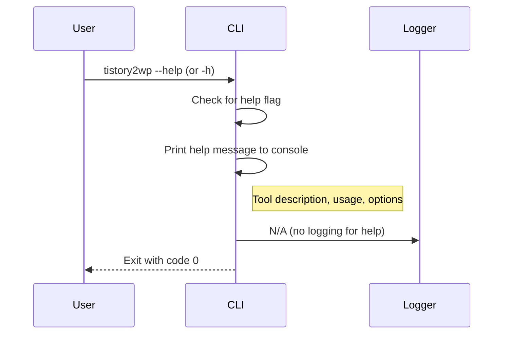
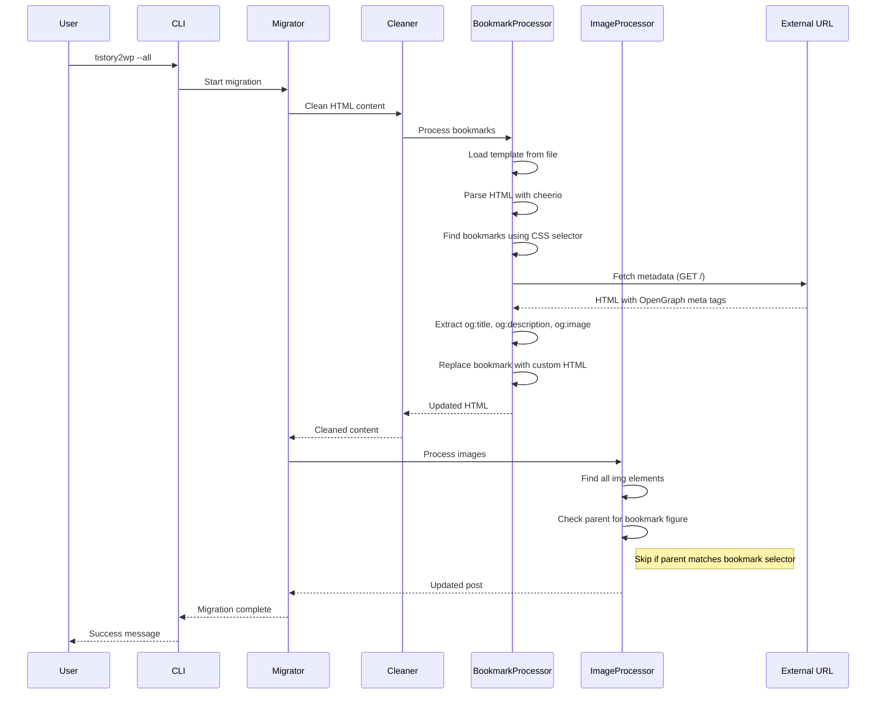
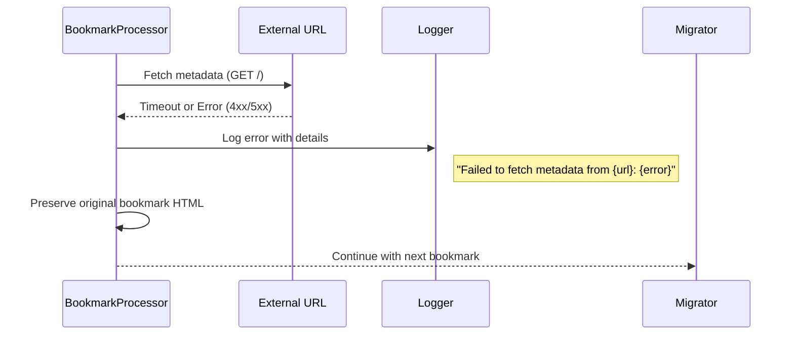

# Sequence Diagram: CLI Help Option & Tistory Bookmark Handling

**Branch**: `007-cli-help-option` | **Date**: 2026-01-06 | **Spec**: [spec.md](./spec.md)
**Purpose**: Visual representation of user journeys, API calls, and system interactions

## Sequence Diagrams

### Feature 1 - CLI Help Option (Priority: P1)

**Key Interactions**:

- Help flag is checked BEFORE config loading and DB initialization
- No database or config validation occurs when help is requested
- Help is displayed using `console.log()` (not logger)
- Exit code 0 indicates successful help display
- All other flags are ignored when help flag is present

---

### Feature 2 - Tistory Bookmark Handling (Priority: P2)

**Key Interactions**:

- Bookmark processing occurs during HTML cleaning phase (before image processing)
- Metadata fetch happens for each bookmark (no caching, 10s timeout per URL)
- If metadata fetch fails, original bookmark HTML is preserved (graceful degradation)
- Image processor checks parent element and skips bookmark featured images
- Each bookmark fetch is independent; one failure doesn't stop the entire post migration

---

### Feature 2 - Bookmark Metadata Fetch Error Flow

**Key Interactions**:

- Error is logged but doesn't stop migration
- Original bookmark HTML is preserved when metadata fetch fails
- Multiple bookmarks can fail independently
- Migration continues to next bookmark or next processing step

---

## Component Definitions

### CLI (cli.ts)

- **Responsibility**: Parse command line arguments, coordinate migration flow
- **Key Operations**: Check for `--help` flag, display help message, invoke migrator

### Migrator (migrator.ts)

- **Responsibility**: Orchestrate post migration workflow
- **Key Operations**: Migrate single or all posts, coordinate crawler, cleaner, and image processor

### Cleaner (cleaner.ts)

- **Responsibility**: Transform raw HTML to cleaned HTML via markdown roundtrip
- **Key Operations**: Extract content using selector, convert to markdown, convert back to HTML, integrate bookmark processor

### BookmarkProcessor (bookmarkProcessor.ts) - NEW

- **Responsibility**: Detect and transform Tistory bookmarks
- **Key Operations**: Load template, parse bookmarks using CSS selector, fetch metadata, replace with custom HTML (including featured image)

### ImageProcessor (imageProcessor.ts)

- **Responsibility**: Download and upload images to WordPress
- **Key Operations**: Find images, check parent elements, skip bookmark featured images, upload images

### Logger (logger.ts)

- **Responsibility**: Log application events and errors
- **Key Operations**: Log debug info, warnings, errors (not used for help messages)

---

## Cross-Feature Interactions

**CLI Help ↔ Bookmark Handling**:

- No direct interaction - features are independent
- Help option bypasses all migration logic including bookmark handling

**BookmarkProcessor ↔ ImageProcessor**:

- BookmarkProcessor replaces bookmark figures with custom HTML
- ImageProcessor checks for bookmark figures to skip featured images
- Interaction occurs via HTML content passed through Cleaner

**BookmarkProcessor ↔ Configuration**:

- BookmarkProcessor reads CSS selector from config (loaded from `.env`)
- Template file path is configurable or fixed in code

---

## Notes

**Performance Considerations**:

- Each bookmark requires an HTTP request (10s timeout)
- No caching means duplicate URLs are fetched multiple times
- Parallel processing of bookmarks is NOT implemented (sequential per post)
- Overall migration overhead should be <20% (success criteria)

**Error Handling Strategy**:

- Per-post error handling: one bookmark failure doesn't stop the entire migration
- Errors are logged but migration continues
- Original content preserved on failure (graceful degradation)

**Threading/Concurrency**:

- Bookmark processing is synchronous within a single post's migration
- Multiple posts are processed in parallel via worker pool (existing architecture)
- Metadata fetch uses axios (non-blocking but awaited per bookmark)

**Security**:

- Metadata from external URLs is sanitized before use in templates
- XSS prevention: HTML escaping for metadata fields
- No code execution in template rendering (simple string replacement)
